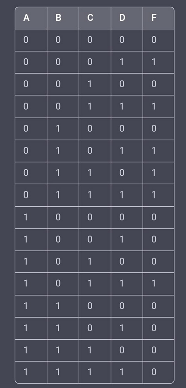
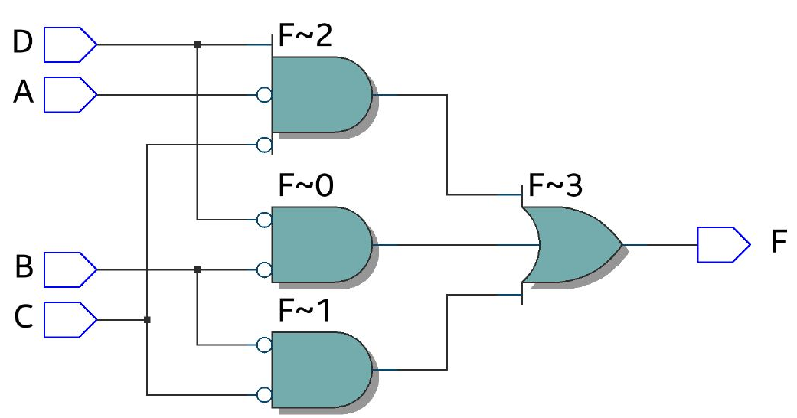

## AIM:

 An algebraic notation used to represent the Boolean function of a logic circuit, 
 it can be used to verify and test the design of the circuit before it is implemented. 
 and verify its truth table in Quartus using Verilog programming.

## Equipments Required:

Hardware – PCs, Cyclone II , USB flasher Software 
Quartus prime Theory Adders are digital circuits that carry out addition of numbers.

## PROCEDURE :
## STEP 1 :
Start by defining the inputs and outputs for the circuit. In this case, the inputs are A, B, C, and D, and the output is F.
## STEP 2 :
Implement the NOT gates for each of the input variables that need to be negated. For example, use NOT gates to create B', C', and D' from B, C, and D respectively.
##STEP 3 :
Implement the AND gates to create the terms B'D', B'C', and A'C'D.
## STEP 4 :
Implement the OR gate to sum up the three terms B'D', B'C', and A'C'D.
## STEP 5 :
Connect the output of the OR gate to the output F of the circuit.
## STEP 6 :
Test the circuit using a truth table, to verify that the output F is correct for all possible input combinations.
## STEP 7 :
Simulate the circuit using appropriate software like ModelSim, Xilinx ISE or Quartus.
## STEP 8 :
Once verified and simulated, the circuit can be implemented on a PCB board or FPGA.

##THEORY :

The logic function F = B'D'+B'C'+A'C'D is a sum-of-products (SOP) expression, which means it is a 
logical OR of one or more ANDed terms. Each term in the SOP expression represents a specific input combination 
that will produce a logic 1 output.The terms in the SOP expression are B'D', B'C', and A'C'D. Each
term is a product of one or more negated input variables, which means that the term will be true only when all 
of its input variables are false.

## TRUTH TABLE :

## OUTPUT :

## RTL DIAGRAM :

## TIMING DIAGRAM :

## RESULT :
thus the given circuit diagram is desigend to verifie its truth table  in Quartus using Verilog programming
